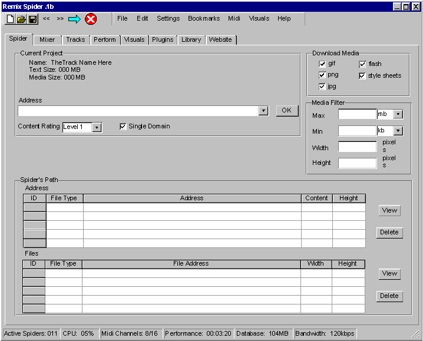
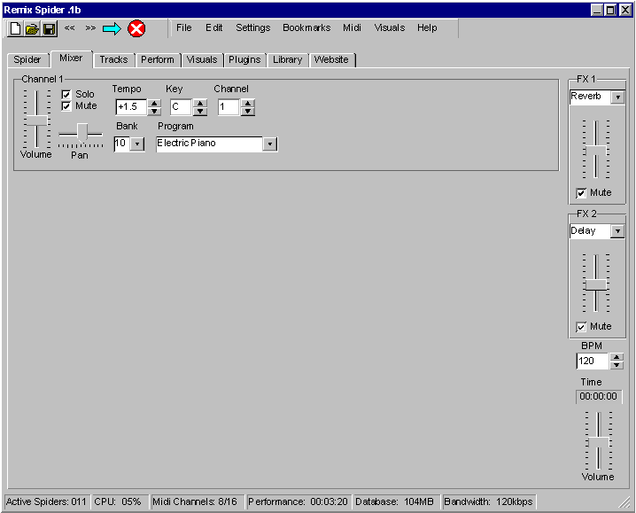
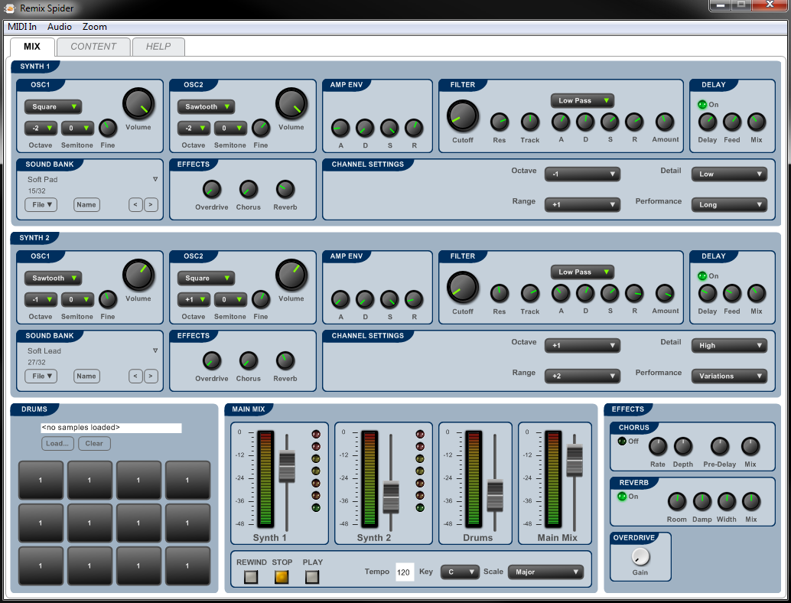
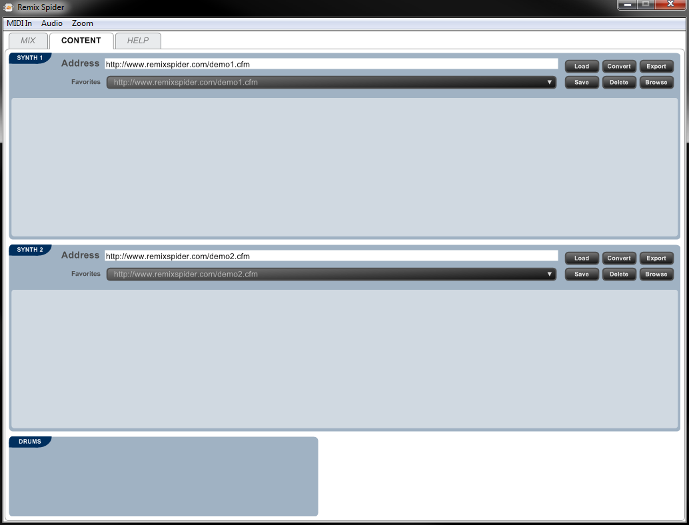
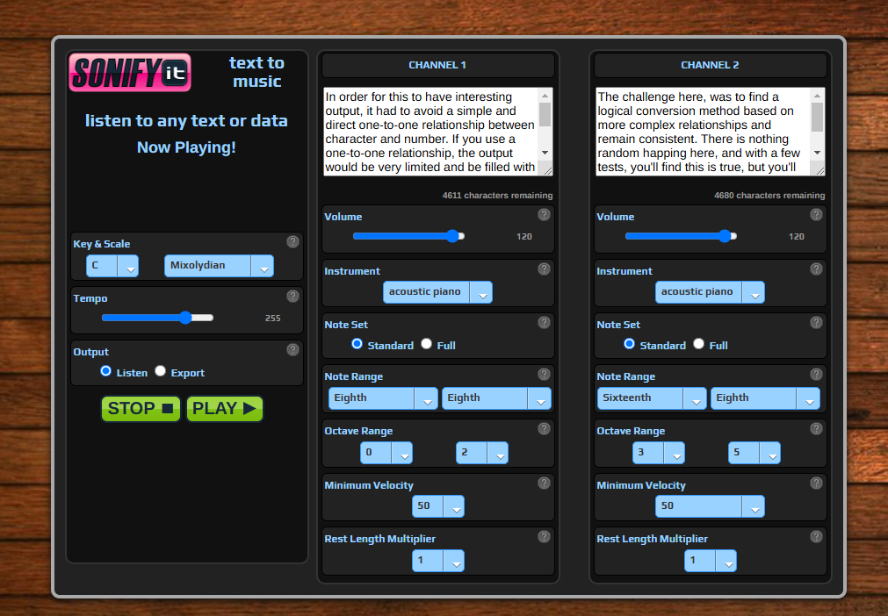

# SonifyIt - convert text into notes

**SonifyIt** - convert text into notes. This is not AI text-to-audio, this is entering a chunk of text, selecting some settings, and having that chunk of text generate 'music' through a conversion process. This is 'generative' music, but it is achived by applying an algorithm, a process. The results... if you set the tempo very slow, it is a nice ambient piece, if you set the tempo very fast, it is a frantic experimental jungle piece.

Please note, this project started in 2016 and has been sitting around untouched since 2017. Still works! In order to run this, you'll need to be running it from a web server due to the audio. If you have Python installed, navigate to the /sonifyit directory using CMD, then run [python -m http.server 8000] and you'll then be able to view this running at: http://127.0.0.1:8000/

## Authors

- [@Emaj7th](https://www.github.com/Emaj7th)

Created With:
- [MIDI.js](https://github.com/mudcube/MIDI.js)
- [MIDI soundfonts](https://github.com/gleitz/midi-js-soundfonts)
- [JZZ.Midi.js](https://github.com/jazz-soft/JZZ)
- [jquery.js](http://jquery.com/)
- [tipr.js](http://www.tipue.com/tipr/)

## How it Works:

In order for this to have interesting output, it had to avoid a simple and direct one-to-one relationship between character and number. If you use a one-to-one relationship, the output would be very limited and be filled with repeating musical phrases. For example, consider the top 100 most common English words. Each of these words would always translate to the same musical progression. The challenge here, was to find a logical conversion method based on more complex relationships and remain consistent. There is nothing random happing here, and with a few tests, you'll find this is true, but you'll also find there are rules being applied. The following explains how this works and the rules that apply.

Using online tools and a spreadsheet, I started with a full listing of every character and number, and converted to binary, hexadecimal, and decimal values. With hexadecimal, any generated text weas then converted again, until there were only numbers. These values were then listed in a table, which were then processed again using basic math to create a final table of numeric values. I'm sure this could work with a different process which would result in a different conversion table. In fact, I hope to offer alternate conversion tables as a feature in later versions.

When you submit the form, each word is extracted using the space as an identifier, then each character is looked up in this conversion table, where multiple values are returned. These values are then processed based on the settings on the form. Each note also gains an offset value based on the length of the word/string it is within. This is why you get a different result if you enter, "111" or "1111" - while the character "1" has a mapping, these two "words" have different offset values - the first being 3, the second being 4. The resulting values define the octave, note value, velocity and duration of each note. The application also uses spaces to generate rests, which for now is using the same duration assigned to the previous note value.

For the final output, the application can then take your resulting text to music conversion, and either play it live in the browser, or output it to a MIDI file for those who are musicians with midi software.

## Fine Tuning:

The initial version successfully generated valid musical output, but it was usually chaotic and didn't "feel" right. After studying the output, I realized I needed to tame it by applying some common musical limitations. Most musical phrases have the following attributes as limitations by design:

**Maximum note distance (fixed)** - most musical phrases utilize a maximum distance between notes, and in most cases it is an octave. In this application, the maximum number of octaves between two notes is limited to one. This means that the next note to be played can be within the current octave, or the octave below it, or the octave above it.

**Maximum velocity variance (fixed)** - most musical phrases don't see a large change in the velocity between notes. In this application, the velocity can only increase or decrease a maximum of 6 values per note.

**Minimum velocity (setting)** - after converting dozens of strings of text, I found the output worked best if there was a mimiumun velocity. I prefer setting this to 50, but feel free to set it however you like.

**Note Values (setting)** - most musical phrases use a smaller sub-set of note values that doesn't include triplets or dotted notes. In this application, you can select to limit the output to the standard set of note values, or use the full set including triplets and dotted notes.

## Concept Origins:

The idea for this first came up around 2005 when I was doing a lot of brainstorming about the Web. I was looking for ways where I could be creative with technology which would result in new ways for other people to express themselves creatively while removing the experience and knowledge barriers that prevent most people from generating or participating in creative works. This effort resulted in to core ideas, Remix Spider - a means to remix the Web, and... the other one isn't built yet! Remix Spider evolved into SonifyIt, the site you see here today.

- **Version 1 - 2005: Remix Spider** - Screen Designs only: The original idea was a local application that would work with multiple channels of data and allow a someone to use general midi sounds or if a musician, route the MIDI data to their MIDI instruments. The application would 'spider' the data, or page, or RSS feed, etc. from the Web, even pulling down images, and resuling in what could be called a "remix browser." The idea quickly became too complicated and was saved off to the directory where I keep random projects and ideas. Here are two of the screen designs:

- **Version 2 - 2015: Remix Spider - PC Application**: I found a development solution called Flowstone that would allow you to create PC applications, and more specifically, the means to create a virtual synthesizer. Flowstone also supports the Ruby programminmg language, which I thought should do the trick, so I finally started to build the idea out. Unfortunately, Flowstone is stuck in 32bit, PC only, and a bit quirky. While I was able to create the instrument side, and part of the text parsing, I aborted the effort after realizing few would ever install the applicaiton and that Flowstone's future was likely dead. This version also failed because it took the idea in a wrong direction. The target audience was 'everyone,' but I designed something for musicians. While V2 is very different from V1, they are both what I would call 'remix browsers.' Here are the two screens of the application:  / 

- **Version 3 - 2016: Sonify It (the current version) - Web Application**: While frustred with the demise of Version 2, I searched the Web to consider the state of audio and MIDI either on the server or client (browser). I found there were very good javascript libraries of code I could build upon to achive my plans directly in the browser. Once I tested these javascript libraries, I dedicated a few hours here and there over serveral months working out the process, logic and producing a conversion table. Once the conversion table was complete, and a few development sessions, I had a working prototype. Once it was working, I picked the name and domain: SonifyIt.com.

